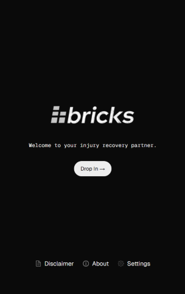
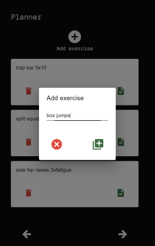

## Welcome!
Bricks Recovery is a tool to help you through your sports injury recovery journey. Inspired and informed by my own ongoing rehab after ACL reconstruction surgery.

<p align="center"><b>
This is a work in progress!
</b></p>

## Progress Sneak Peak



<p align="center"><i>
"I am who I am today because of what I did yesterday, what I do today will determine who I am tomorrow."
</i></p>

## Development

First, run the development server:

```bash
npm run dev
# or
yarn dev
# or
pnpm dev
# or
bun dev
```

Open [http://localhost:3000](http://localhost:3000) with your browser to see the result.
