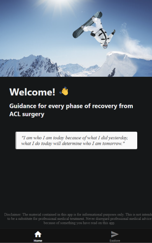

## Welcome!
ACL Recovery Buddy is a tool to help you through your ACL recovery journey! Inspired and informed by my own ongoing rehab after ACL reconstruction surgery.

<p align="center"><b>
This is a work in progress!
</b></p>

## Progress Sneak Peak



## My Story
At the start of winter 2023, feeling lost with a life that was supposed to be "right" but didn't feel like it, I quit my stable 9-5 software engineering job and started working terrain parks at a ski resort. I was making less than half of what I used to make and living in my car, but I was the happiest and fittest I've ever been in my life.

Then in March 2024, on duty at Breckenridge Ski Resort, I went off a usual jump in the Freeway terrain park. But this time, the snow was sticky and I knuckled it. My knee twisted out, popped, and gave out. I got back up and the knee popped again... That was probably the nail in the coffin.

The leg wouldn't hold any weight, so I rode switch to patrol. They didn't think it was bad and sent me off with a brace and crutches. My MRI later said differently - complete ACL tear with an estimated 9 months recovery timeline. Sitting in that doctor's office, it felt like my world had come crashing down. I had put my stable life on the line to pursue a dream and it blew up in my face.

I'm 7 months post surgery now with little idea of when I'll be back on snow, and there are a lot of emotions. "Why did this happen, I'm 25 and should be in the prime of my life, this is what I get for trying to be brave and follow a dream?" Etc. It's constantly hard trying to fill the hole in my heart.

But there are a lot of beautiful and growing experiences that, I have to admit, I would never have gotten without this. Empathy for fellow injured folks, humility ("I don't know as much as I thought I did" - still working on that), the amazing and interesting people met through my overturned life, and learning to cope with uncontrollable events (the hardest lesson).

As much as I repeatedly turn over the events of that day in my head with sadness, all I can say to the people around me since then is, thank you.

I was scrolling Instagram early on in this process looking for guidance, and I came across this quote that I think about frequently: 

<p align="center"><i>
"I am who I am today because of what I did yesterday, what I do today will determine who I am tomorrow."
</i></p>

What we do today for recovery, the consistent work we put into PT, the other ways we find to fill our hearts - I'm hopeful it will pay off 🙂 Life happens, but the question to ask is maybe not "why", but rather, "what are you going to do about it?"

## Development

First, run the development server:

```bash
npm run dev
# or
yarn dev
# or
pnpm dev
# or
bun dev
```

Open [http://localhost:3000](http://localhost:3000) with your browser to see the result.
